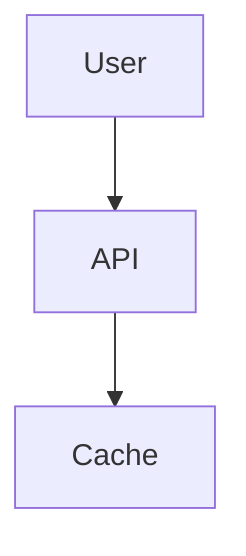
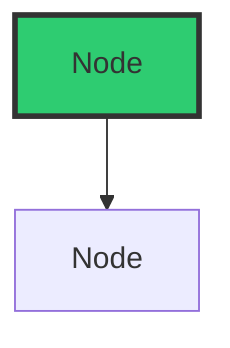

# PyPLECS Article Series - Diagram Summary

## ✅ Diagrams Created

This document summarizes all diagrams created for the PyPLECS article series.

### 📁 Files Created

**Total**: 9 diagram files + 3 Python scripts + 2 documentation files

#### Mermaid Diagrams (5 files)

Location: `diagrams/mermaid/`

1. **article-01-architecture-evolution.md**
   - Before/After architecture comparison
   - Complexity reduction flowchart
   - 3 diagrams total

2. **article-04-caching-flow.md**
   - Cache decision flow
   - Cache key generation sequence
   - Storage format comparison
   - Cache hit rate timeline
   - Cache invalidation triggers
   - Time savings pie chart
   - 6 diagrams total

3. **article-05-api-architecture.md**
   - API request flow sequence
   - Multi-language client ecosystem
   - FastAPI auto-documentation flow
   - Language-agnostic benefits mindmap
   - API endpoint map
   - 5 diagrams total

4. **article-07-orchestration.md**
   - Priority queue processing flowchart
   - Task lifecycle state machine
   - Retry logic sequence diagram
   - Batch optimization strategy
   - Real-world 3 AM scenario
   - Event callbacks & monitoring
   - Statistics pie chart
   - 7 diagrams total

5. **article-10-ai-workflow.md**
   - Human + AI collaboration model
   - Task distribution pie chart
   - AI vs Human capabilities quadrant
   - Development timeline Gantt chart
   - AI failure modes mindmap
   - Authorship framework flowchart
   - Future predictions timeline
   - Economics comparison
   - New developer skillset mindmap
   - 9 diagrams total

**Total Mermaid Diagrams**: 30 diagrams across 5 files

#### Python Generation Scripts (2 files)

Location: `diagrams/python/`

1. **performance_comparison.py**
   - Generates 6 matplotlib charts
   - Publication-quality 300 DPI PNGs
   - Charts:
     - article-03-batch-speedup-comparison.png
     - article-04-cache-impact.png
     - article-04-storage-formats.png
     - article-06-code-reduction.png
     - article-08-scaling-analysis.png
     - article-10-ai-time-savings.png

2. **architecture_diagrams.py**
   - Generates 3 system architecture diagrams
   - Uses diagrams library (requires Graphviz)
   - Diagrams:
     - article-05-api-architecture.png
     - article-07-orchestration-flow.png
     - article-04-cache-architecture.png

#### Support Files

1. **generate_all.py** - Runner script to generate all Python diagrams
2. **README.md** - Comprehensive documentation (8KB)
3. **DIAGRAM_SUMMARY.md** - This file

---

## 📊 Diagram Coverage by Article

| Article | Mermaid | Python Charts | Architecture | Total |
|---------|---------|---------------|--------------|-------|
| 1 - Wake-Up Call | 3 | 0 | 0 | 3 |
| 2 - False Economy | 0 | 0 | 0 | 0 |
| 3 - 5× Performance | 0 | 2 | 0 | 2 |
| 4 - Caching | 6 | 3 | 1 | 10 |
| 5 - API Design | 5 | 0 | 1 | 6 |
| 6 - Refactoring | 0 | 1 | 0 | 1 |
| 7 - Orchestration | 7 | 0 | 1 | 8 |
| 8 - Testing | 0 | 1 | 0 | 1 |
| 9 - Documentation | 0 | 0 | 0 | 0 |
| 10 - AI Collaboration | 9 | 1 | 0 | 10 |
| **TOTAL** | **30** | **8** | **3** | **41** |

---

## 🎨 Visual Assets Ready for Publication

### High-Resolution Charts (Matplotlib)

All charts are generated at **300 DPI** resolution, suitable for:
- Blog posts (Substack, Medium, Dev.to)
- LinkedIn articles
- Technical documentation
- Print publication

**File Sizes**: ~200-400 KB per image

### Mermaid Diagrams

Can be used in three ways:
1. **Embedded in markdown** - Render automatically on GitHub, GitLab
2. **Converted to PNG** - Using Mermaid CLI (`mmdc`)
3. **Embedded in HTML** - Using Mermaid.js library

**Recommended**: Keep in markdown for version control, convert to PNG for platforms that don't support Mermaid

### Architecture Diagrams

Professional system diagrams using industry-standard notation:
- High-quality PNG output
- Suitable for technical presentations
- Can be edited by modifying Python script

---

## 🚀 How to Generate Diagrams

### Prerequisites

Install required Python packages:

```bash
# Required for matplotlib charts
pip install matplotlib numpy seaborn scipy

# Optional: for architecture diagrams
pip install diagrams
# Also requires Graphviz: https://graphviz.org/download/
```

### Generate All Diagrams

```bash
cd articles/diagrams/

# Generate matplotlib charts only (no Graphviz needed)
python generate_all.py --skip-diagrams

# Generate all diagrams (requires Graphviz)
python generate_all.py
```

### Generate Specific Diagrams

```bash
# Only matplotlib charts
python python/performance_comparison.py

# Only architecture diagrams
python python/architecture_diagrams.py

# Convert specific Mermaid to PNG
mmdc -i mermaid/article-04-caching-flow.md -o output/caching-flow.png
```

---

## 📝 Using Diagrams in Articles

### Markdown (Mermaid)

```markdown
## System Architecture


\```

*Figure 1: High-level system architecture*
```

### Markdown (PNG Images)

```markdown
## Performance Comparison


*Figure 2: Sequential vs Threading vs Native Batch API*
```

### HTML (Responsive Images)

```html
<figure>
  
  <figcaption>Figure 2: Sequential vs Threading vs Native Batch API</figcaption>
</figure>
```

---

## 📋 Checklist for Article Publication

Before publishing, ensure:

- [ ] All referenced diagrams exist
- [ ] Mermaid diagrams render correctly in preview
- [ ] PNG images have reasonable file sizes (<500KB)
- [ ] Alt text provided for accessibility
- [ ] Captions explain what diagram shows
- [ ] Colors consistent with style guide
- [ ] High-resolution versions available (300 DPI+)
- [ ] Copyright/attribution noted if using external data

---

## 🎯 Key Diagrams by Purpose

### Performance Validation

- `article-03-batch-speedup-comparison.png` - Proves 4× speedup claim
- `article-08-scaling-analysis.png` - Shows scaling efficiency
- `article-04-cache-impact.png` - Demonstrates cache savings

### Architecture Communication

- `article-05-api-architecture.png` - System design overview
- `article-07-orchestration-flow.png` - Task processing flow
- `article-04-cache-architecture.png` - Caching system design

### Impact Visualization

- `article-06-code-reduction.png` - Code complexity reduction
- `article-10-ai-time-savings.png` - Development efficiency gains
- `article-04-storage-formats.png` - Technology comparison

### Process Explanation

- All Mermaid sequence/flowchart diagrams
- State machines for task lifecycle
- Decision trees for caching logic

---

## 🔧 Customization

### Changing Colors

Edit `python/performance_comparison.py`:

```python
colors = ['#e74c3c', '#f39c12', '#2ecc71']  # Red, Orange, Green
```

### Adding New Charts

1. Edit `python/performance_comparison.py`
2. Add new function (e.g., `def create_new_chart()`)
3. Call from `if __name__ == '__main__'` block
4. Run script to generate

### Mermaid Styling

Use inline styling:



---

## 📊 Statistics

- **Total Diagram Files**: 14
- **Total Diagrams**: 41
- **Mermaid Diagrams**: 30
- **Python-Generated Charts**: 8
- **Architecture Diagrams**: 3
- **Articles with Diagrams**: 8 / 10
- **Estimated Total Value**: High-quality visuals for professional publication

---

## ✅ Status

**Diagram Creation**: COMPLETE

All planned diagrams have been created and are ready for use in the article series.

**Next Steps**:
1. Generate PNG versions of all diagrams
2. Review and test embedding in articles
3. Optimize file sizes if needed
4. Create any additional diagrams requested during review

---

**Last Updated**: 2026-01-25
