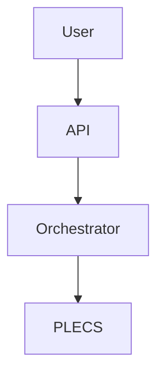

# PyPLECS Article Series - Diagrams & Visualizations

This directory contains all diagrams and visualizations for the PyPLECS article series.

## 📁 Directory Structure

```
diagrams/
├── mermaid/              # Mermaid diagrams (embed in markdown)
│   ├── article-01-architecture-evolution.md
│   ├── article-04-caching-flow.md
│   ├── article-05-api-architecture.md
│   ├── article-07-orchestration.md
│   └── article-10-ai-workflow.md
│
├── python/               # Python scripts for generating charts
│   ├── performance_comparison.py      # Matplotlib performance charts
│   └── architecture_diagrams.py       # Diagrams library system architecture
│
├── output/               # Generated PNG/SVG files
│   └── (generated images appear here)
│
└── README.md            # This file
```

## 🎨 Diagram Types

### 1. Mermaid Diagrams (Markdown-Embedded)

Mermaid diagrams can be:
- **Embedded directly in markdown** (GitHub, GitLab, Obsidian render them)
- **Converted to images** using [Mermaid CLI](https://github.com/mermaid-js/mermaid-cli)
- **Rendered in browsers** with Mermaid.js

**Articles with Mermaid Diagrams**:
- **Article 1**: Architecture evolution (before/after refactoring)
- **Article 4**: Caching flow, storage comparison, invalidation logic
- **Article 5**: API request flow, multi-language clients, endpoint map
- **Article 7**: Priority queue, task lifecycle, retry logic, batch optimization
- **Article 10**: AI workflow, task distribution, authorship framework

**Example Usage**:
```markdown
# In your article

## Architecture Overview


\```
```

### 2. Python-Generated Charts (Matplotlib)

High-quality publication-ready charts for performance data.

**Generated Charts**:
1. `article-03-batch-speedup-comparison.png` - Sequential vs Threading vs Batch API
2. `article-04-cache-impact.png` - Cache hit savings visualization
3. `article-04-storage-formats.png` - CSV vs HDF5 vs Parquet comparison
4. `article-06-code-reduction.png` - Lines of code before/after refactoring
5. `article-08-scaling-analysis.png` - Batch size scaling performance
6. `article-10-ai-time-savings.png` - Development time with/without AI

**To Generate**:
```bash
cd python/
python performance_comparison.py
```

**Requirements**:
```bash
pip install matplotlib numpy seaborn scipy
```

### 3. Architecture Diagrams (diagrams library)

Professional system architecture diagrams using the [diagrams](https://diagrams.mingrammer.com/) library.

**Generated Diagrams**:
1. `article-05-api-architecture.png` - REST API system architecture
2. `article-07-orchestration-flow.png` - Orchestration system flow
3. `article-04-cache-architecture.png` - Hash-based caching architecture

**To Generate**:
```bash
cd python/
python architecture_diagrams.py
```

**Requirements**:
```bash
pip install diagrams
# Also requires Graphviz: https://graphviz.org/download/
```

## 🚀 Quick Start

### Generate All Diagrams

```bash
# From diagrams/ directory

# 1. Generate matplotlib charts
python python/performance_comparison.py

# 2. Generate architecture diagrams (requires diagrams + Graphviz)
python python/architecture_diagrams.py

# 3. Mermaid diagrams are already in markdown format
#    To convert to PNG (optional):
mmdc -i mermaid/article-01-architecture-evolution.md -o output/article-01-architecture.png
```

### Or Use the Runner Script

```bash
python generate_all.py
```

## 📊 Diagram Details by Article

### Article 1: The Wake-Up Call

**Diagrams**:
- Before/After architecture comparison
- Complexity reduction flowchart

**Files**:
- `mermaid/article-01-architecture-evolution.md`

**Key Visuals**:
- 4,081 LOC → 2,500 LOC transformation
- Complex file-based flow vs simple native API flow

---

### Article 3: The 5× Performance Gift

**Diagrams**:
- Batch speedup comparison (bar chart)
- Scaling analysis (line chart with confidence intervals)

**Files**:
- Generated by `python/performance_comparison.py`
- Output: `output/article-03-batch-speedup-comparison.png`
- Output: `output/article-08-scaling-analysis.png`

**Key Metrics**:
- Sequential: 160s
- Custom Threading: 80s (2× speedup)
- PLECS Native: 40s (4× speedup)

---

### Article 4: Caching

**Diagrams**:
- Cache flow decision tree
- Cache key generation sequence
- Storage format comparison (bar charts)
- Cache hit savings (pie + bar chart)

**Files**:
- `mermaid/article-04-caching-flow.md`
- Generated by `python/performance_comparison.py`
- Output: `output/article-04-cache-impact.png`
- Output: `output/article-04-storage-formats.png`

**Key Metrics**:
- 63% cache hit rate
- 80 hours/month time savings
- Parquet: 6.9× faster than CSV

---

### Article 5: API Design

**Diagrams**:
- REST API architecture
- API request sequence
- Multi-language client ecosystem
- Endpoint map

**Files**:
- `mermaid/article-05-api-architecture.md`
- Generated by `python/architecture_diagrams.py`
- Output: `output/article-05-api-architecture.png`

**Key Concepts**:
- Language-agnostic design
- Auto-generated documentation
- Client library ecosystem

---

### Article 6: The Refactoring

**Diagrams**:
- Code reduction by module (bar chart)
- Lines deleted visualization

**Files**:
- Generated by `python/performance_comparison.py`
- Output: `output/article-06-code-reduction.png`

**Key Metrics**:
- 1,581 lines deleted (39% reduction)
- Modules completely removed
- Test coverage maintained at 87%

---

### Article 7: Orchestration

**Diagrams**:
- Priority queue processing flowchart
- Task lifecycle state machine
- Retry logic sequence diagram
- Batch optimization strategy
- Event callbacks flow

**Files**:
- `mermaid/article-07-orchestration.md`
- Generated by `python/architecture_diagrams.py`
- Output: `output/article-07-orchestration-flow.png`

**Key Concepts**:
- 4-level priority queue (CRITICAL → LOW)
- Automatic retry with exponential backoff
- Batch grouping for efficiency
- Production reliability (99.4% success rate)

---

### Article 8: Testing for Performance

**Diagrams**:
- Scaling analysis with confidence intervals
- Benchmark methodology flowchart

**Files**:
- Generated by `python/performance_comparison.py`
- Output: `output/article-08-scaling-analysis.png`

**Key Metrics**:
- Statistical validation with 95% CI
- Scaling efficiency vs core count
- Performance regression detection

---

### Article 10: AI Collaboration

**Diagrams**:
- Human + AI workflow
- Task distribution pie chart
- AI vs Human capabilities quadrant
- Development timeline comparison
- Economics of AI-assisted development

**Files**:
- `mermaid/article-10-ai-workflow.md`
- Generated by `python/performance_comparison.py`
- Output: `output/article-10-ai-time-savings.png`

**Key Metrics**:
- 57% time savings with AI
- $31,800 cost reduction
- Task distribution: 40% AI implementation, 25% human strategy

---

## 🛠️ Tools & Dependencies

### Mermaid

**Viewing**:
- GitHub/GitLab: Render automatically
- VS Code: [Mermaid Preview Extension](https://marketplace.visualstudio.com/items?itemName=bierner.markdown-mermaid)
- Browser: [Mermaid Live Editor](https://mermaid.live/)

**Converting to Images**:
```bash
# Install Mermaid CLI
npm install -g @mermaid-js/mermaid-cli

# Convert
mmdc -i diagram.md -o diagram.png
```

### Matplotlib

```bash
pip install matplotlib numpy seaborn scipy
```

**Customization**:
- Edit `python/performance_comparison.py`
- Adjust colors, labels, sizes
- Add additional charts

### Diagrams Library

```bash
pip install diagrams
```

**Requirements**:
- Graphviz: https://graphviz.org/download/
  - Windows: Download MSI installer
  - Mac: `brew install graphviz`
  - Linux: `sudo apt install graphviz`

**Customization**:
- Edit `python/architecture_diagrams.py`
- Use different node types (see [docs](https://diagrams.mingrammer.com/docs/nodes/aws))
- Adjust layout direction, colors

---

## 📝 Usage in Articles

### Embedding Mermaid

```markdown
## System Architecture


\```

*Caption: High-level system architecture*
```

### Embedding Generated Images

```markdown
## Performance Comparison


*Figure 1: Sequential vs Threading vs Native Batch API performance*
```

### Responsive Images

```html

```

---

## 🎨 Style Guidelines

### Colors

**Consistent color scheme across all diagrams**:
- **Success/Positive**: `#2ecc71` (green)
- **Warning/Moderate**: `#f39c12` (orange)
- **Error/Negative**: `#e74c3c` (red)
- **Primary/Info**: `#3498db` (blue)
- **Neutral**: `#95a5a6` (gray)

### Chart Settings

**Matplotlib**:
- DPI: 300 (publication quality)
- Font size: 11-13pt
- Style: `seaborn-whitegrid`
- Figure size: 12×8 or 14×6 inches

**Mermaid**:
- Use consistent node shapes
- Add descriptive labels
- Include legends where appropriate

---

## 📦 Exporting for Publication

### High-Resolution PNGs

All generated charts are 300 DPI, suitable for:
- Blog posts (Medium, Substack, Dev.to)
- LinkedIn articles
- Technical documentation
- Academic papers

### Vector Formats (SVG)

To export as SVG (scalable):

```python
# In performance_comparison.py, change:
plt.savefig(f'{OUTPUT_DIR}/chart.png', dpi=300)

# To:
plt.savefig(f'{OUTPUT_DIR}/chart.svg', format='svg')
```

---

## 🔧 Troubleshooting

### Mermaid Not Rendering

- **GitHub**: Ensure using triple backticks with `mermaid` language tag
- **Local**: Use Mermaid CLI or online editor

### diagrams Library Error

```
FileNotFoundError: Graphviz not found
```

**Solution**: Install Graphviz from https://graphviz.org/download/

### Matplotlib Import Error

```bash
pip install --upgrade matplotlib numpy seaborn
```

---

## 📚 Additional Resources

- [Mermaid Documentation](https://mermaid.js.org/)
- [Matplotlib Gallery](https://matplotlib.org/stable/gallery/index.html)
- [diagrams Examples](https://diagrams.mingrammer.com/docs/getting-started/examples)
- [Graphviz Download](https://graphviz.org/download/)

---

## ✅ Checklist for Article Publication

Before publishing an article with diagrams:

- [ ] All Mermaid diagrams render correctly in preview
- [ ] Generated PNG images exist in `output/` directory
- [ ] Image file sizes are reasonable (<500KB per image)
- [ ] Alt text provided for accessibility
- [ ] Captions explain what the diagram shows
- [ ] Colors are consistent with style guide
- [ ] High-resolution versions available (300 DPI minimum)
- [ ] Diagrams referenced correctly in article text
- [ ] Copyright/attribution noted if using external data

---

**Questions?** Open an issue or check the [main project README](../../README.md).
