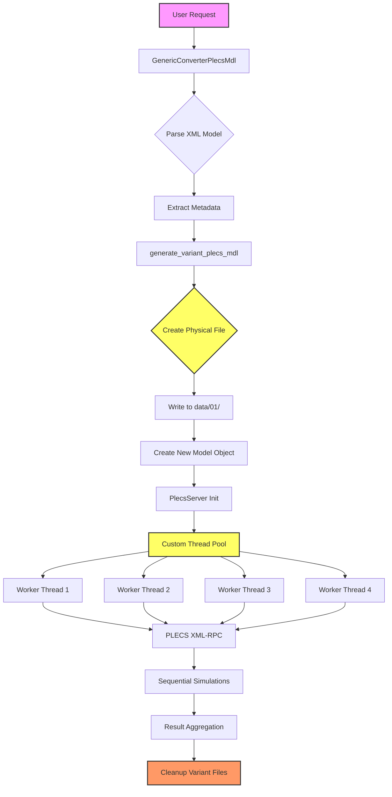
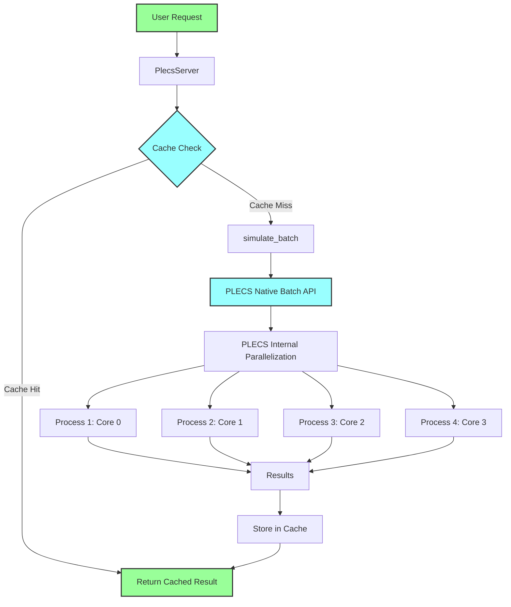
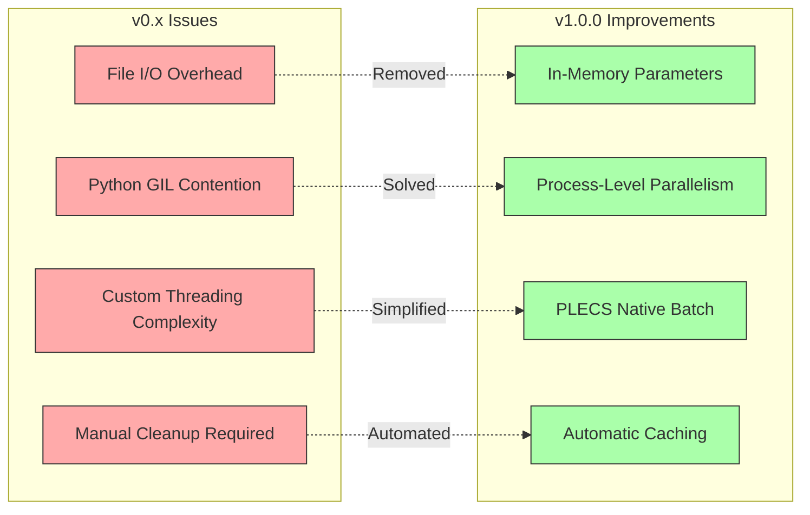

# Article 1: Architecture Evolution Diagram

## Before Refactoring (v0.x) - Complex Architecture

**Complexity**: HIGH
**LOC**: 4,081
**Performance**: 2× baseline (custom threading)

## After Refactoring (v1.0.0) - Simplified Architecture

**Complexity**: LOW
**LOC**: 2,500 (39% reduction)
**Performance**: 4-5× baseline (native parallelization)

## Comparison Summary

