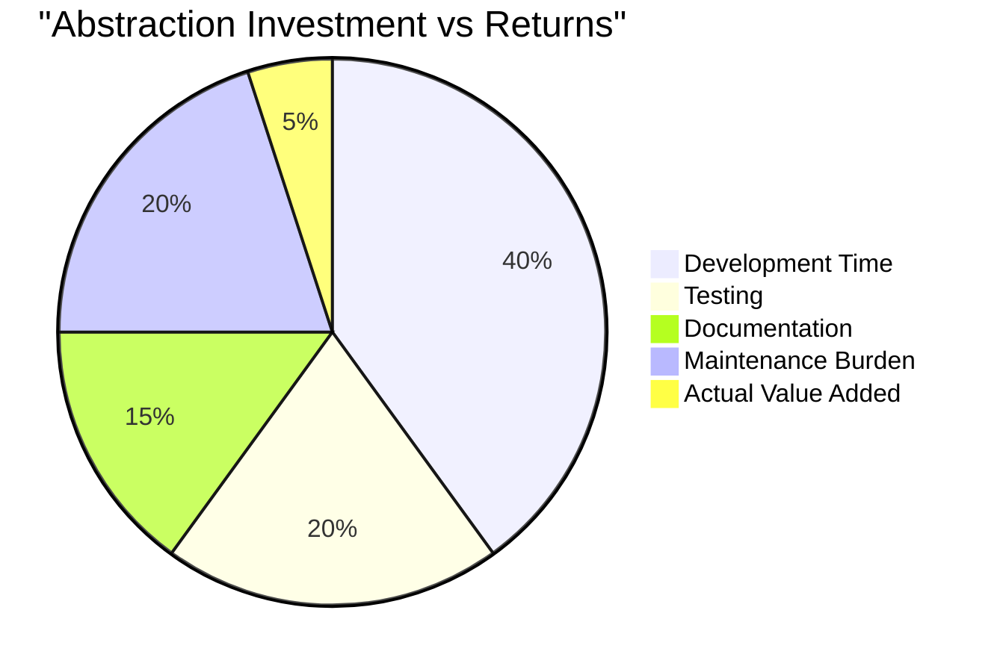
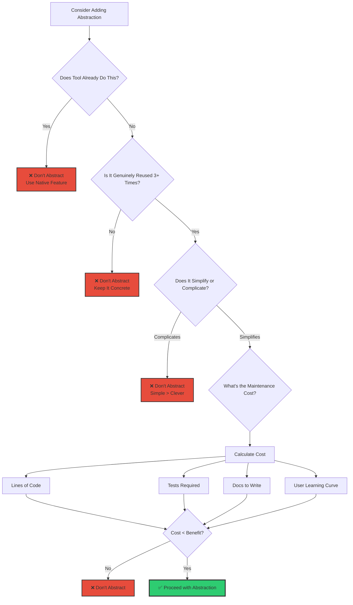
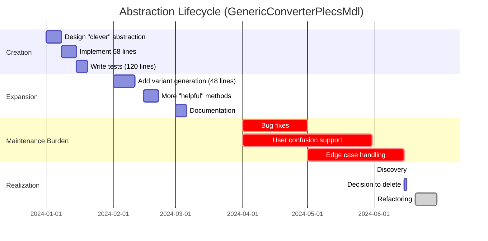
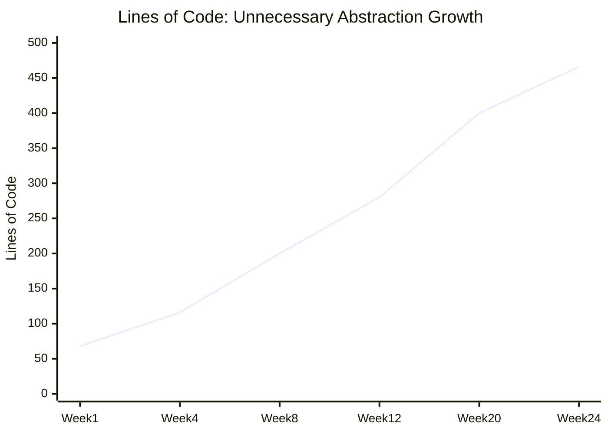
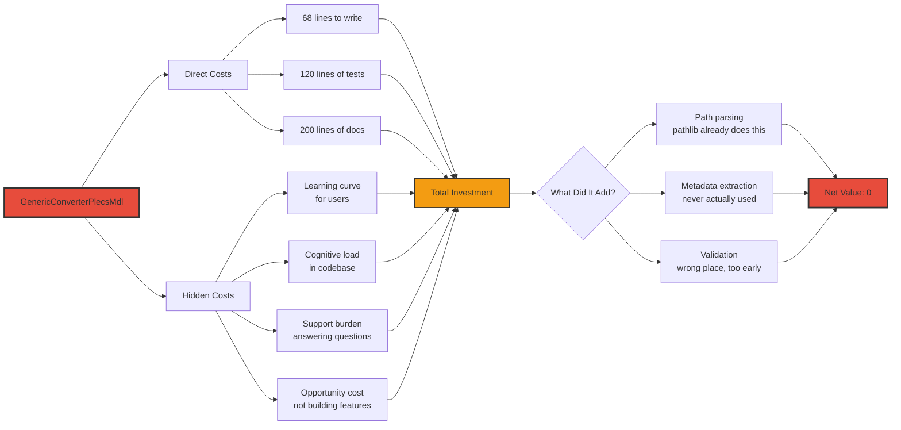
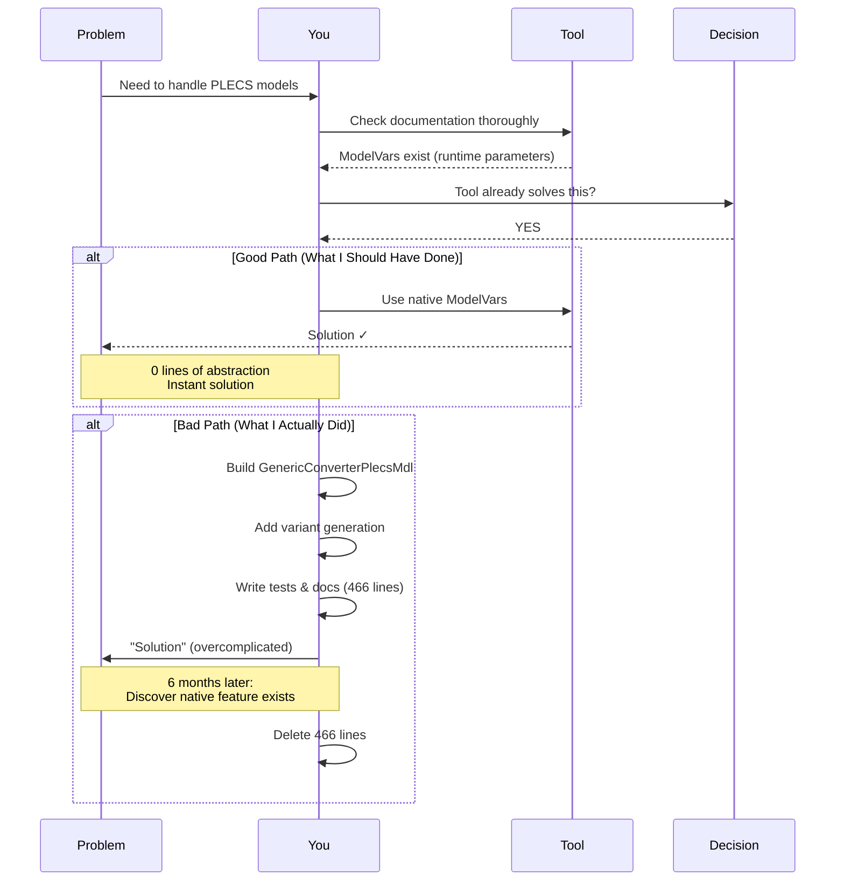
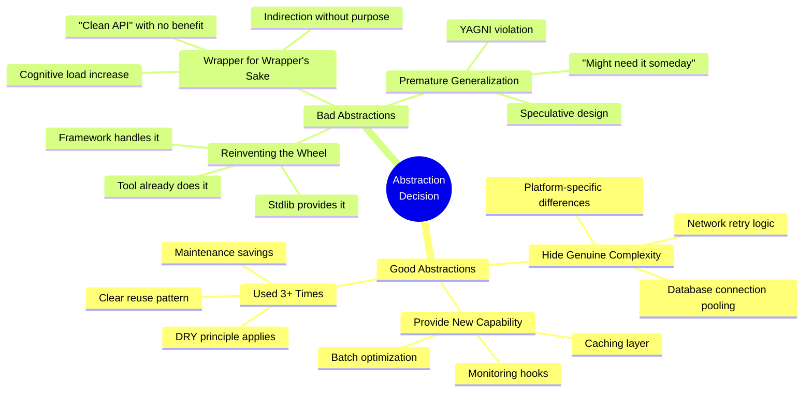
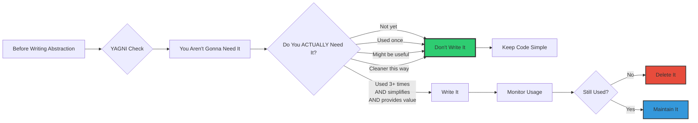
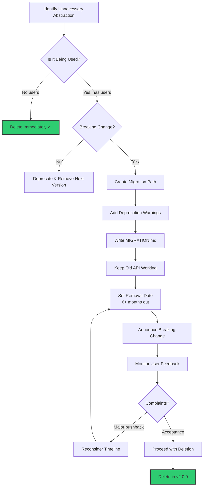

# Article 2: The False Economy of Abstraction

## The Abstraction Problem: Before/After

```mermaid
graph TD
    subgraph "Before: With Abstraction (4 layers)"
        A1[User] --> A2[GenericConverterPlecsMdl]
        A2 --> A3[Parse XML<br/>Extract Metadata]
        A3 --> A4[generate_variant_plecs_mdl]
        A4 --> A5[Regex XML Manipulation]
        A5 --> A6[Create Physical File<br/>data/01/model01.plecs]
        A6 --> A7[PlecsServer<br/>sim_path + sim_name]
        A7 --> A8[PLECS XML-RPC]
    end

    subgraph "After: Direct API (1 layer)"
        B1[User] --> B2[PlecsServer<br/>model_file]
        B2 --> B3[PLECS XML-RPC<br/>ModelVars parameter]
    end

    style A2 fill:#e74c3c,stroke:#333
    style A4 fill:#e74c3c,stroke:#333
    style A6 fill:#e74c3c,stroke:#333
    style B2 fill:#2ecc71,stroke:#333,stroke-width:3px
```

**Complexity**:
- Before: 4 abstraction layers, 68 + 48 = 116 lines
- After: 1 thin wrapper, direct native API
- Reduction: **88% fewer lines**

## Cost/Benefit Analysis

**Investment**: 95 units of effort
**Return**: 5 units of value
**ROI**: -90% (negative return)

## The Abstraction Decision Tree

## Abstraction Lifecycle: Technical Debt Accumulation

**Total Time Lost**: ~5 months building/maintaining unnecessary abstraction

## Complexity Growth Over Time

**Trajectory**: Started with "simple" 68-line class, grew to 466 lines (6.8× growth)

## The False Economy: Cost Breakdown

**Verdict**: 388 lines of code + hidden costs → Zero value added

## What to Do Instead

## Abstraction Patterns: Good vs Bad

## Lessons: The YAGNI Principle

**Key Insight**: Most abstractions you think you need, you don't.

## The Deletion Decision

**Golden Rule**: Respect your users' code, but don't let it paralyze progress.
