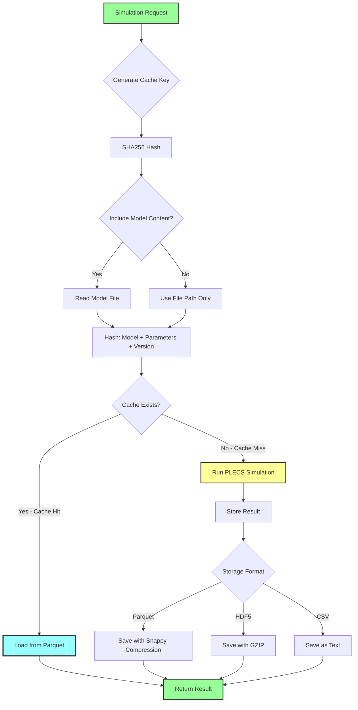
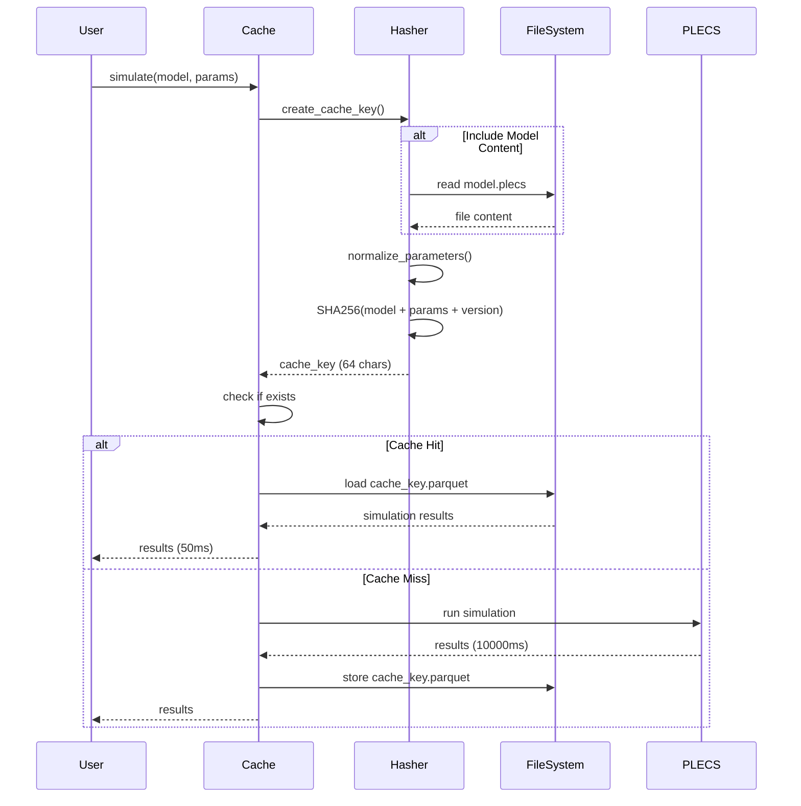
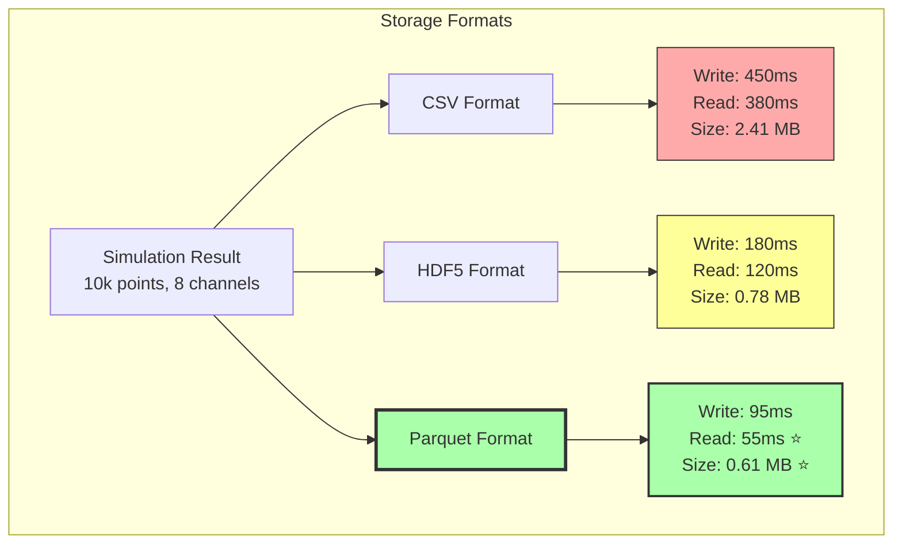
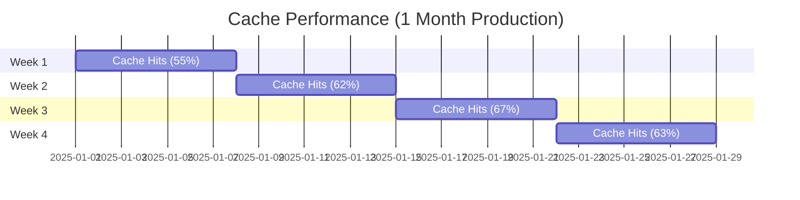
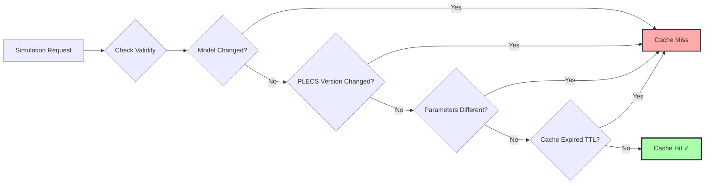
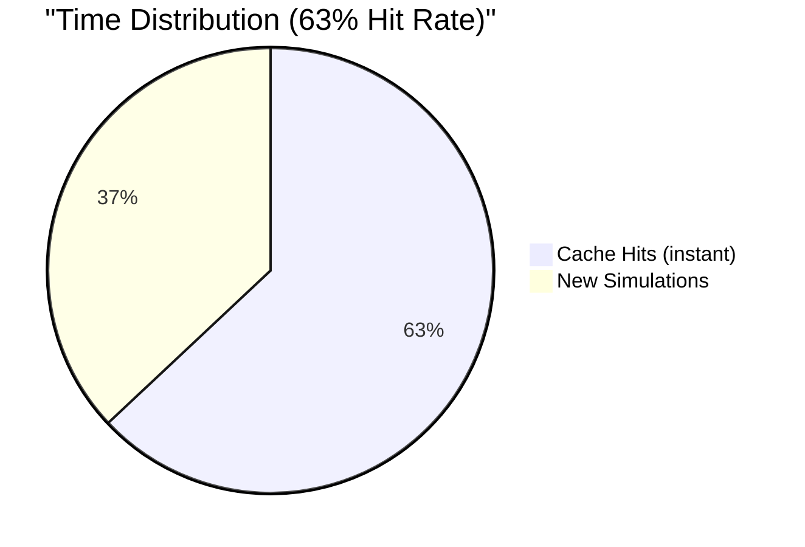

# Article 4: Caching System Flow Diagram

## Cache Decision Flow

## Cache Key Generation

## Cache Storage Comparison

## Cache Hit Rate Over Time

## Cache Invalidation Triggers

## Time Savings Visualization

**Impact**:
- **Without Cache**: 100 simulations × 10s = 1000s (16.7 min)
- **With Cache** (63% hit rate):
  - 63 hits × 0.05s = 3.15s
  - 37 misses × 10s = 370s
  - **Total**: 373s (6.2 min) → **2.7× speedup**
