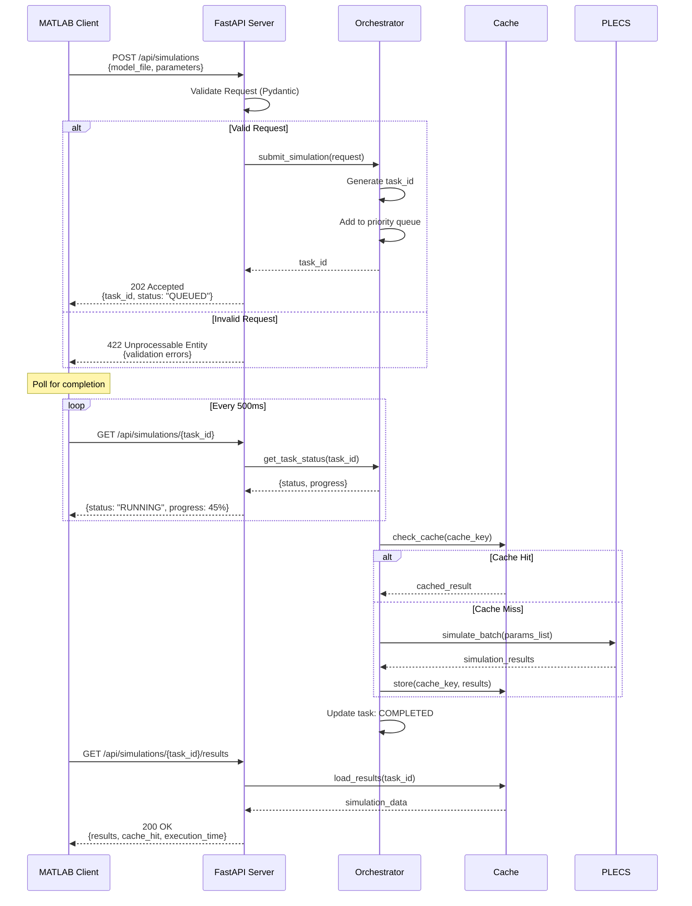
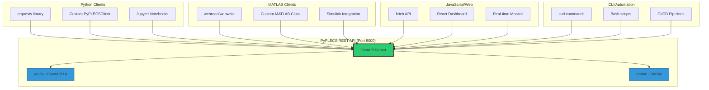
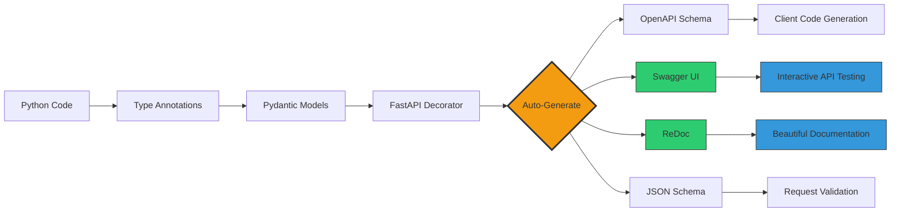
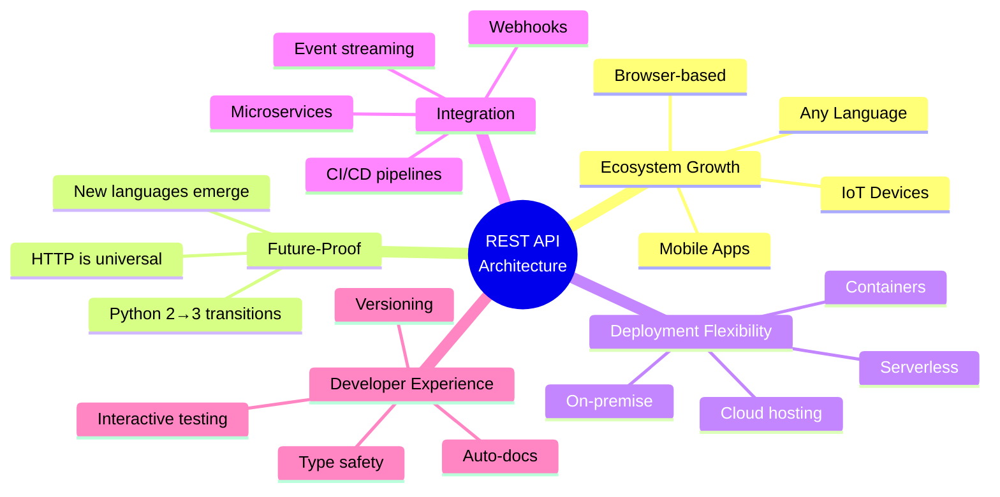
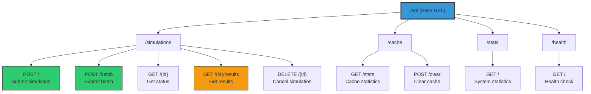

# Article 5: REST API Architecture Diagrams

## API Request Flow

```mermaid
sequenceDiagram
    participant M as MATLAB Client
    participant A as FastAPI Server
    participant O as Orchestrator
    participant C as Cache
    participant P as PLECS

    M->>A: POST /api/simulations<br/>{model_file, parameters}
    A->>A: Validate Request (Pydantic)

    alt Valid Request
        A->>O: submit_simulation(request)
        O->>O: Generate task_id
        O->>O: Add to priority queue
        O-->>A: task_id
        A-->>M: 202 Accepted<br/>{task_id, status: "QUEUED"}
    else Invalid Request
        A-->>M: 422 Unprocessable Entity<br/>{validation errors}
    end

    Note over M: Poll for completion

    loop Every 500ms
        M->>A: GET /api/simulations/{task_id}
        A->>O: get_task_status(task_id)
        O-->>A: {status, progress}
        A-->>M: {status: "RUNNING", progress: 45%}
    end

    O->>C: check_cache(cache_key)

    alt Cache Hit
        C-->>O: cached_result
    else Cache Miss
        O->>P: simulate_batch(params_list)
        P-->>O: simulation_results
        O->>C: store(cache_key, results)
    end

    O->>O: Update task: COMPLETED

    M->>A: GET /api/simulations/{task_id}/results
    A->>C: load_results(task_id)
    C-->>A: simulation_data
    A-->>M: 200 OK<br/>{results, cache_hit, execution_time}
```

## Multi-Language Client Ecosystem

```mermaid
graph TB
    subgraph "PyPLECS REST API (Port 8000)"
        API[FastAPI Server]
        DOCS["/docs - OpenAPI UI"]
        REDOC["/redoc - ReDoc"]
    end

    subgraph "Python Clients"
        PY1[requests library]
        PY2[Custom PyPLECSClient]
        PY3[Jupyter Notebooks]
    end

    subgraph "MATLAB Clients"
        ML1[webread/webwrite]
        ML2[Custom MATLAB Class]
        ML3[Simulink Integration]
    end

    subgraph "JavaScript/Web"
        JS1[fetch API]
        JS2[React Dashboard]
        JS3[Real-time Monitor]
    end

    subgraph "CLI/Automation"
        CLI1[curl commands]
        CLI2[Bash scripts]
        CLI3[CI/CD Pipelines]
    end

    PY1 --> API
    PY2 --> API
    PY3 --> API
    ML1 --> API
    ML2 --> API
    ML3 --> API
    JS1 --> API
    JS2 --> API
    JS3 --> API
    CLI1 --> API
    CLI2 --> API
    CLI3 --> API

    API --> DOCS
    API --> REDOC

    style API fill:#2ecc71,stroke:#333,stroke-width:3px
    style DOCS fill:#3498db,stroke:#333
    style REDOC fill:#3498db,stroke:#333
```

## FastAPI Auto-Documentation Flow

```mermaid
flowchart LR
    A[Python Code] --> B[Type Annotations]
    B --> C[Pydantic Models]
    C --> D[FastAPI Decorator]

    D --> E{Auto-Generate}

    E --> F[OpenAPI Schema]
    E --> G[Swagger UI]
    E --> H[ReDoc]
    E --> I[JSON Schema]

    F --> J[Client Code Generation]
    G --> K[Interactive API Testing]
    H --> L[Beautiful Documentation]
    I --> M[Request Validation]

    style E fill:#f39c12,stroke:#333,stroke-width:3px
    style G fill:#2ecc71,stroke:#333
    style H fill:#2ecc71,stroke:#333
    style K fill:#3498db,stroke:#333
    style L fill:#3498db,stroke:#333
```

## Language-Agnostic Benefits

```mermaid
mindmap
    root((REST API<br/>Architecture))
        Ecosystem Growth
            Any Language
            Browser-based
            Mobile Apps
            IoT Devices
        Future-Proof
            Python 2→3 transitions
            New languages emerge
            HTTP is universal
        Deployment Flexibility
            Cloud hosting
            Containers
            Serverless
            On-premise
        Integration
            CI/CD pipelines
            Webhooks
            Event streaming
            Microservices
        Developer Experience
            Auto-docs
            Interactive testing
            Type safety
            Versioning
```

## API Endpoint Map

```mermaid
graph TD
    ROOT["/api (Base URL)"]

    ROOT --> SIM["/simulations"]
    SIM --> POST_SIM["POST /<br/>Submit simulation"]
    SIM --> BATCH["POST /batch<br/>Submit batch"]
    SIM --> GET_SIM["GET /{id}<br/>Get status"]
    SIM --> GET_RES["GET /{id}/results<br/>Get results"]
    SIM --> DEL_SIM["DELETE /{id}<br/>Cancel simulation"]

    ROOT --> CACHE["/cache"]
    CACHE --> GET_CACHE["GET /stats<br/>Cache statistics"]
    CACHE --> POST_CLEAR["POST /clear<br/>Clear cache"]

    ROOT --> SYS["/stats"]
    SYS --> GET_STATS["GET /<br/>System statistics"]

    ROOT --> HEALTH["/health"]
    HEALTH --> GET_HEALTH["GET /<br/>Health check"]

    style ROOT fill:#3498db,stroke:#333,stroke-width:3px
    style POST_SIM fill:#2ecc71,stroke:#333
    style BATCH fill:#2ecc71,stroke:#333
    style GET_RES fill:#f39c12,stroke:#333
```
