# Article 7: Orchestration System Diagrams

## Priority Queue Processing

## Task Lifecycle States

## Retry Logic with Exponential Backoff

## Batch Optimization Strategy

## Real-World Scenario: 3 AM Production

```mermaid
gantt
    title Production Scenario: Automatic Retry Saves the Day
    dateFormat HH:mm
    axisFormat %H:%M

    section Background Jobs
    Long Parameter Sweep (LOW) :active, bg1, 02:00, 2h

    section Critical Task
    Production Design Verification (CRITICAL) :crit, task1, 03:00, 10m

    section Failure & Recovery
    First Attempt (Connection Error) :crit, fail1, 03:00, 5s
    Retry Delay :03:00, 5s
    Second Attempt (Success!) :done, success, 03:00, 10m

    section User Experience
    User Sleeps :03:00, 3h
    User Wakes Up :milestone, 06:00, 0m
    Sees Completed Results :done, 06:00, 5m
```

## Event Callbacks & Monitoring

## Statistics Tracking

**Key Metrics**:
- **Total Simulations**: 9,050
- **Success Rate**: 99.4% (with retries)
- **Retry Effectiveness**: 90% of failures recovered
- **Average Retries per Failed Task**: 1.7
