# Article 9: Documentation - The Feature No One Writes, Everyone Needs

## Documentation Architecture: The Four Pillars

```mermaid
graph TD
    ROOT[PyPLECS Documentation] --> P1[Pillar 1:<br/>Getting Started]
    ROOT --> P2[Pillar 2:<br/>Reference]
    ROOT --> P3[Pillar 3:<br/>Architecture]
    ROOT --> P4[Pillar 4:<br/>Migration]

    P1 --> P1A[README.md<br/>Quick start]
    P1 --> P1B[INSTALL.md<br/>Setup guide]
    P1 --> P1C[Examples/<br/>Code samples]

    P2 --> P2A[API.md<br/>REST endpoints]
    P2 --> P2B[/docs<br/>Auto-generated<br/>OpenAPI]
    P2 --> P2C[Docstrings<br/>Inline docs]

    P3 --> P3A[CLAUDE.md<br/>For developers]
    P3 --> P3B[Architecture<br/>diagrams]
    P3 --> P3C[Design decisions<br/>ADRs]

    P4 --> P4A[MIGRATION.md<br/>Upgrade guides]
    P4 --> P4B[CHANGELOG.md<br/>Version history]
    P4 --> P4C[Breaking changes<br/>announcements]

    style P1 fill:#3498db,stroke:#333,stroke-width:2px
    style P2 fill:#2ecc71,stroke:#333,stroke-width:2px
    style P3 fill:#f39c12,stroke:#333,stroke-width:2px
    style P4 fill:#e74c3c,stroke:#333,stroke-width:2px
```

**Coverage**: Each pillar serves a different user need and journey stage.

## Documentation Workflow: Write Once, Generate Many

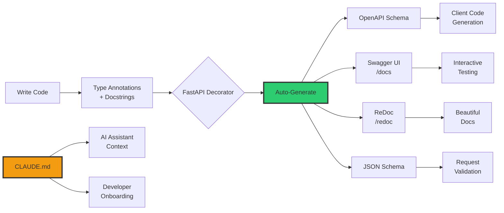

**Principle**: Write documentation in code, auto-generate the rest.

## ROI of Documentation: Support Ticket Reduction

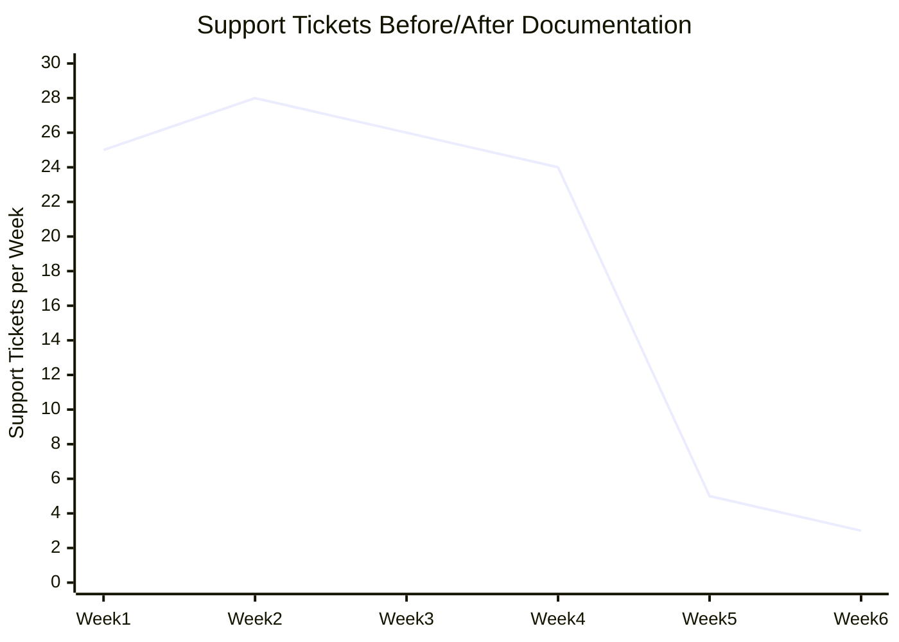

**Impact**:
- Before MIGRATION.md: 25 tickets/week ("How do I upgrade?")
- After MIGRATION.md: 3 tickets/week
- **Reduction**: 88%

## Documentation Types by User Journey

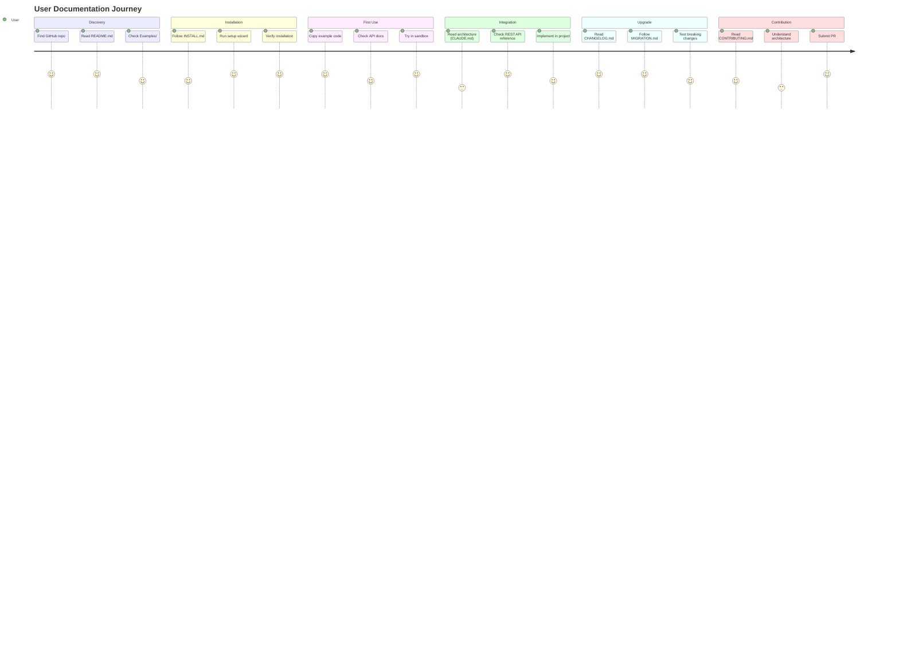

**Insight**: Different docs needed at different stages. Missing any = frustrated users.

## MIGRATION.md Structure: The Gold Standard

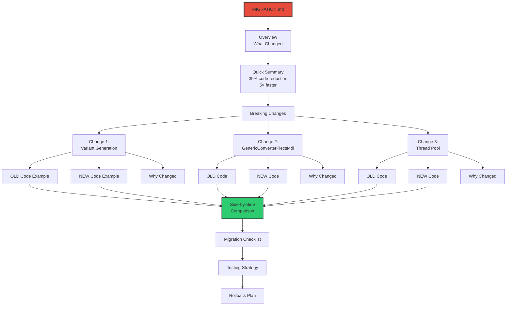

**Formula**: For every breaking change: OLD → NEW → WHY → HOW

## The Economics of Documentation

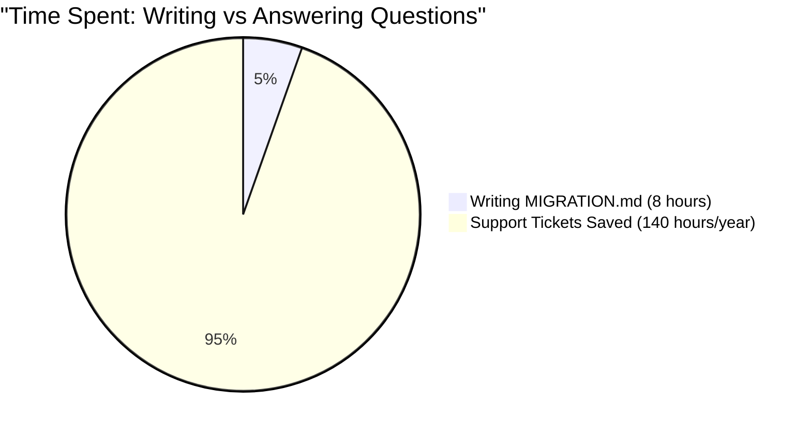

**ROI**: 8 hours investment → 140 hours saved → **17.5× return**

## CLAUDE.md: Documentation for AI Assistants

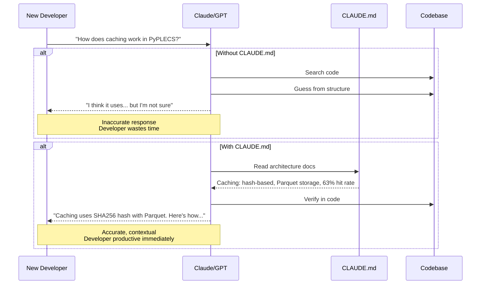

**Innovation**: Documentation optimized for AI reading, helps humans too.

## Documentation Maintenance: Living Docs

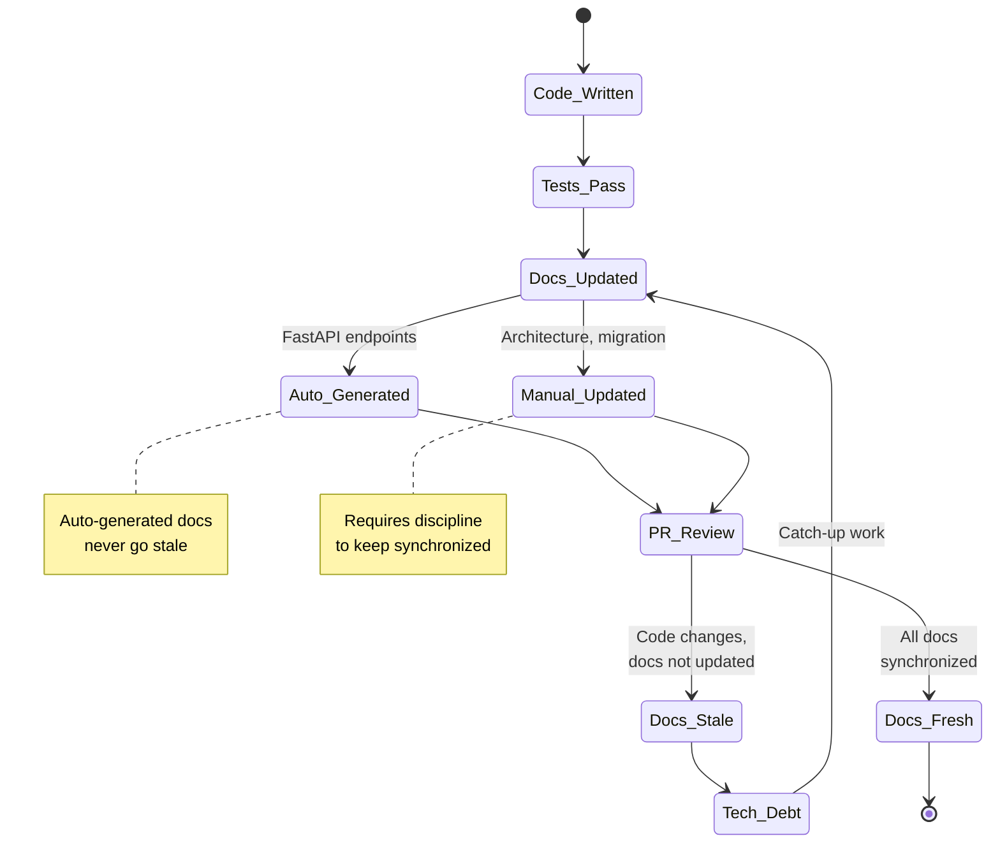

**Solution**: Automate what you can, enforce reviews for what you can't.

## Documentation Checklist: Pre-Release

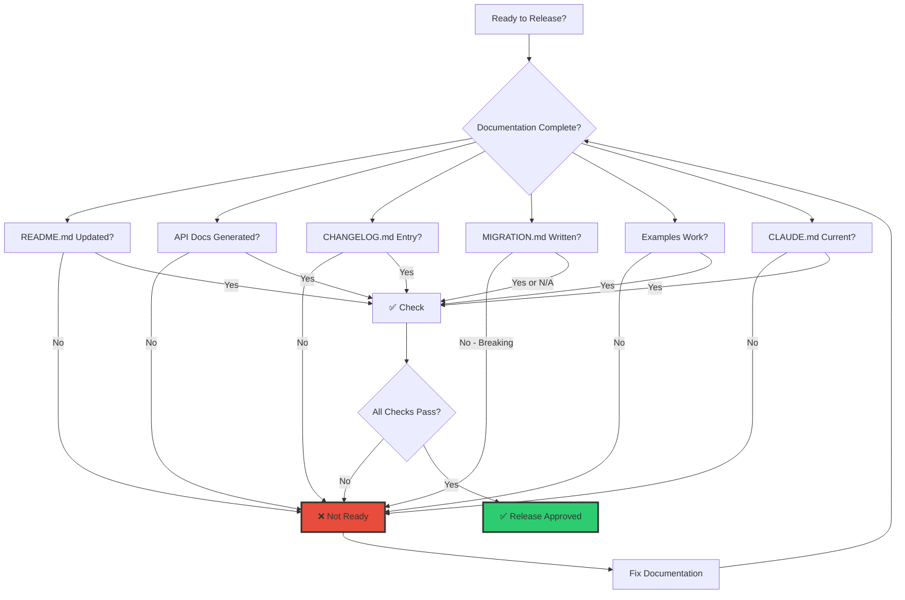

**Policy**: No release without complete documentation.

## The Support Burden: Before & After

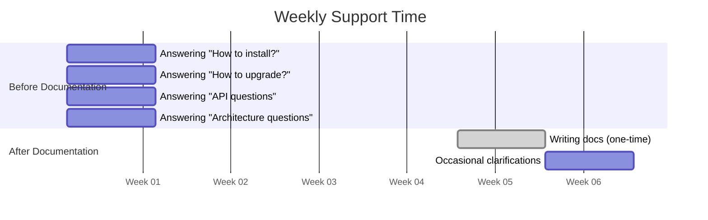

**Time Savings**:
- Before: 28 hours/week answering repeated questions
- After: 2 hours/week clarifications
- **Saved**: 26 hours/week × 52 weeks = 1,352 hours/year

## Documentation as a Feature

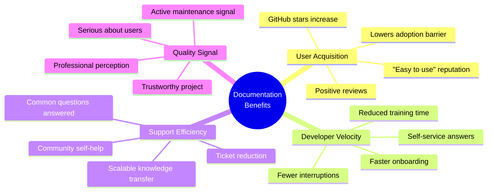

**Insight**: Good documentation is a competitive advantage.

## The Hidden Cost of Bad Documentation

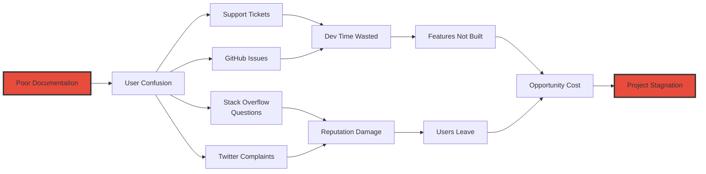

**Cost**: Poor docs → Support burden → Lost velocity → Project death spiral

## Documentation Investment: Cost vs Savings

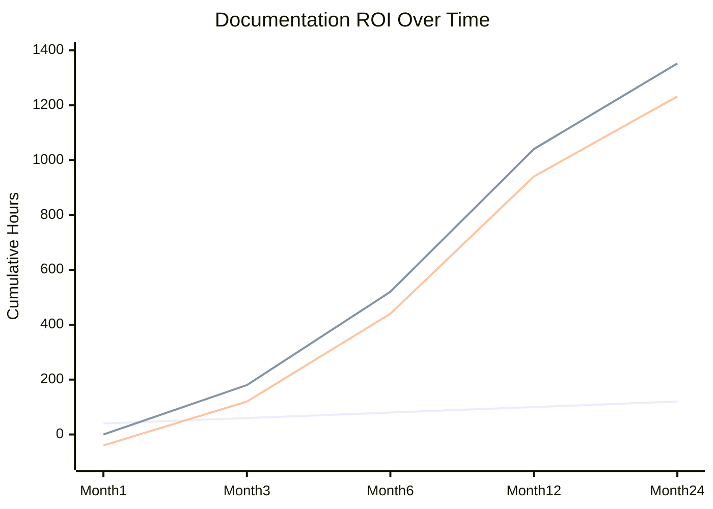

**Break-Even**: ~2 months
**Annual ROI**: **11.3× return** (120 hours invested → 1,352 saved)

## The Documentation Hierarchy of Needs

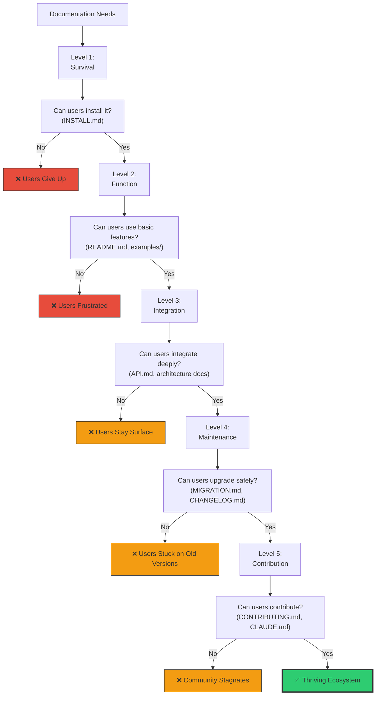

**Principle**: Each level builds on the previous. Skip one, users get stuck there.
