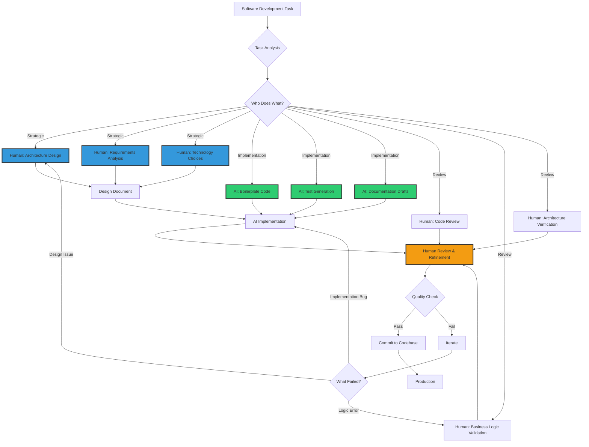
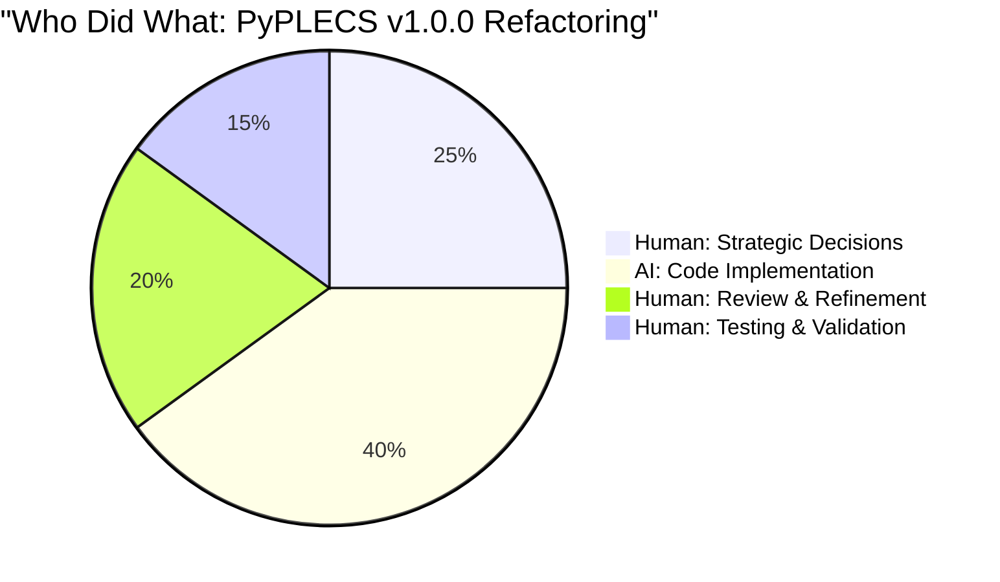
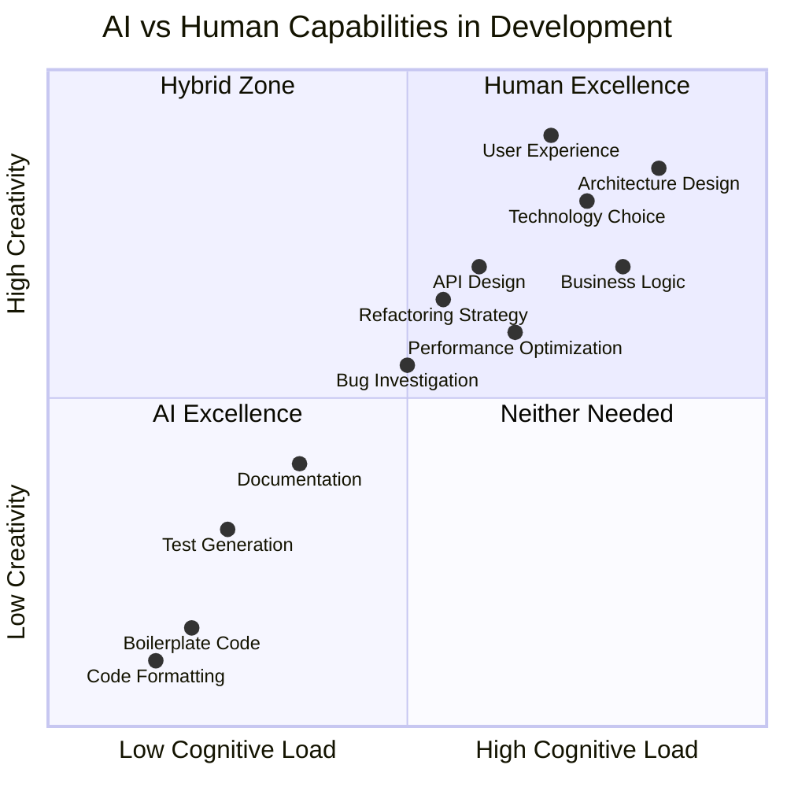
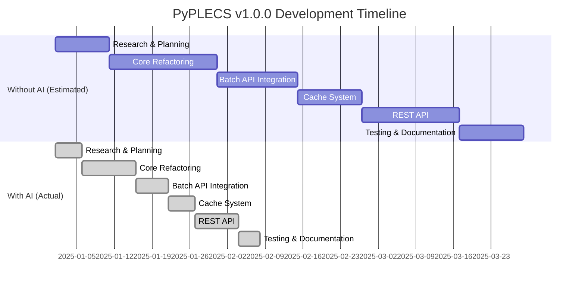
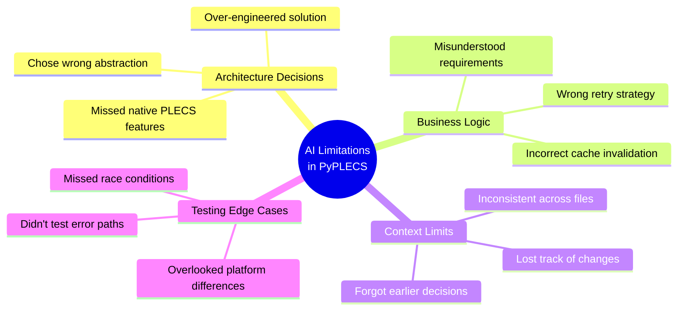
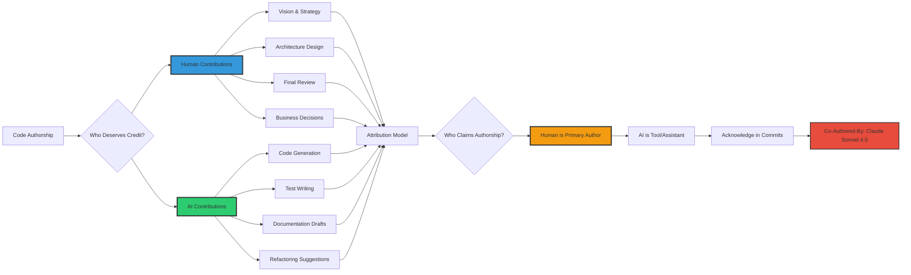
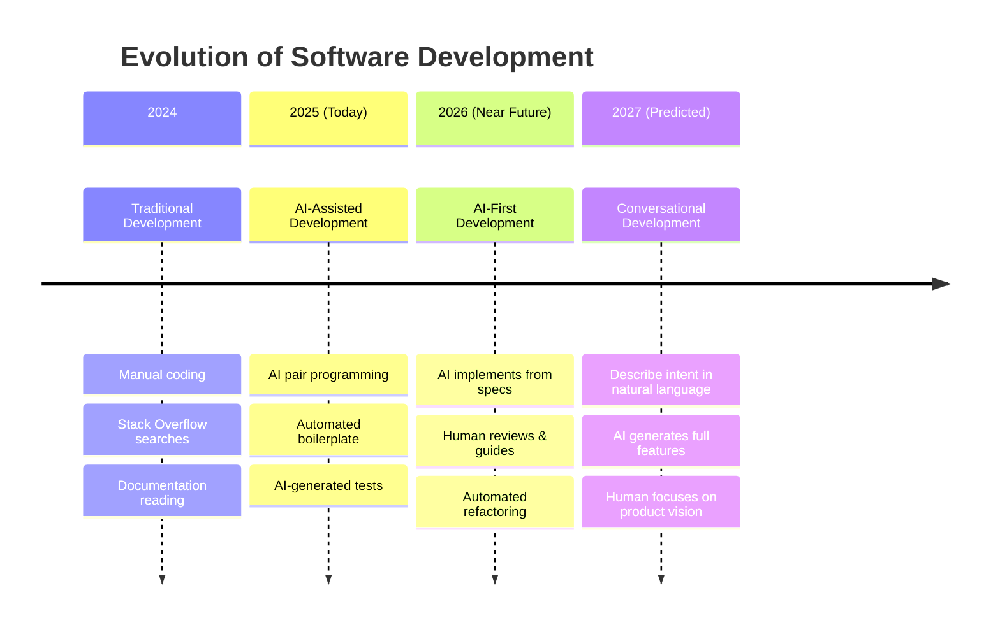
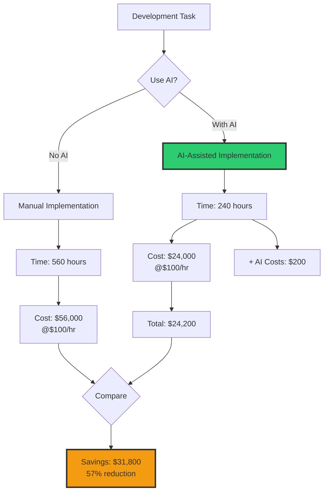
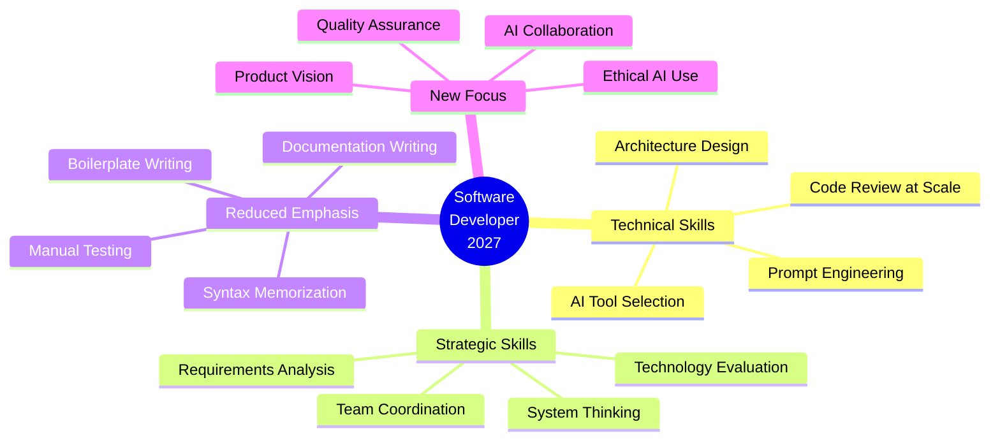

# Article 10: AI-Assisted Development Workflow

## Human + AI Collaboration Model

## PyPLECS Refactoring: Task Distribution

## AI Strengths vs Human Strengths

## Development Timeline: With vs Without AI

**Total Time**:
- Without AI: 87 days (~3 months)
- With AI: 38 days (~5.5 weeks)
- **Time Saved**: 56% (49 days)

## AI Failure Modes Encountered

## Authorship Framework

## Future Predictions: Coding in 2027

## Economics of AI-Assisted Development

## The New Developer Skillset (2027)

