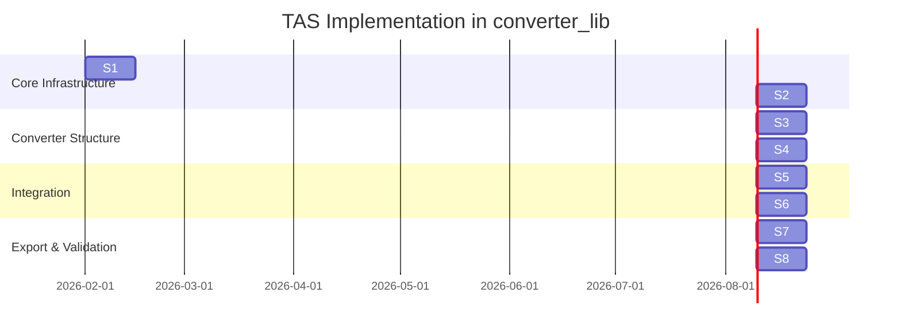

# TAS Implementation Timeline - Visual Overview

## Sprint Gantt Chart



## Architecture Overview

```
┌─────────────────────────────────────────────────────────────────────┐
│                           TAS Document                               │
├─────────────────┬─────────────────────────┬─────────────────────────┤
│     INPUTS      │       CONVERTER         │        OUTPUTS          │
├─────────────────┼─────────────────────────┼─────────────────────────┤
│ DesignReqs      │ TopologyType            │ LossBreakdown           │
│ OperatingPoints │ SubNetworks             │ Efficiency              │
│ Constraints     │ Components              │ ThermalResults          │
│                 │ Netlist                 │ Volumes                 │
└────────┬────────┴───────────┬─────────────┴────────────┬────────────┘
         │                    │                          │
         ▼                    ▼                          ▼
┌─────────────────┐  ┌─────────────────────┐  ┌─────────────────────┐
│ converter_lib Bridge  │  │ Component Database  │  │ ElectricalKPI       │
│ - TimeSeries    │  │ - Switches          │  │ - ThermalKPI        │
│ - OperatingPt   │  │ - Capacitors        │  │ (existing)          │
└─────────────────┘  │ - MAS Integration   │  └─────────────────────┘
                     └─────────────────────┘
                              │
                              ▼
                     ┌─────────────────────┐
                     │ EXPORTERS           │
                     │ - PLECS             │
                     │ - LTspice           │
                     │ - GeckoCircuits     │
                     │ - SPICE Netlist     │
                     └─────────────────────┘
```

## Sprint Dependencies

```
        ┌──────────┐
        │    S1    │ Core Models
        │ (20h)    │ PhysicalQuantity, Waveform, TAS Root
        └────┬─────┘
             │
    ┌────────┼────────┐
    │        │        │
    ▼        ▼        ▼
┌──────┐ ┌──────┐ ┌──────┐
│  S2  │ │  S7  │ │      │
│(20h) │ │(25h) │ │      │
│Inputs│ │Export│ │      │
└──┬───┘ └──────┘ │      │
   │              │      │
   ▼              │      │
┌──────┐          │      │
│  S3  │◄─────────┘      │
│(25h) │                 │
│Convrt│                 │
└──┬───┘                 │
   │                     │
   ├─────────┬───────────┘
   │         │
   ▼         ▼
┌──────┐ ┌──────┐
│  S4  │ │  S6  │
│(20h) │ │(15h) │
│Comp  │ │ MAS  │
└──┬───┘ └──┬───┘
   │        │
   ▼        │
┌──────┐    │
│  S5  │◄───┘
│(20h) │
│Output│
└──┬───┘
   │
   ▼
┌──────┐
│  S8  │
│(15h) │
│Valid │
└──────┘
```

## Effort Distribution

| Sprint | Effort | Cumulative |
|--------|--------|------------|
| S1     | 20h    | 20h        |
| S2     | 20h    | 40h        |
| S3     | 25h    | 65h        |
| S4     | 20h    | 85h        |
| S5     | 20h    | 105h       |
| S6     | 15h    | 120h       |
| S7     | 25h    | 145h       |
| S8     | 15h    | **160h**   |

## Key Deliverables per Sprint

### S1: Foundation
- `PhysicalQuantity` con unit handling
- `Waveform` types (sampled, PWL, analytical)
- JSON Schema validator
- Bridge to converter_lib `TimeSeries`

### S2: Inputs
- `DesignRequirements` completo
- `OperatingPoint` con excitations
- `Constraints` per optimization bounds

### S3: Converter
- `TopologyType` enum (30+ topologies)
- `SubNetwork` polymorphism
- `Netlist` con SPICE export

### S4: Components
- `SwitchComponent` model completo
- `CapacitorComponent` model
- Database loader (JSON/SQLite)
- 10+ real components

### S5: Outputs
- `LossBreakdown` gerarchico
- `ThermalResults` con limit check
- Integration con `ElectricalKPI`

### S6: MAS
- MAS file loader
- OpenMagnetics API client
- Bidirectional conversion

### S7: Exporters
- PLECS .plecs export
- LTspice .asc export
- Generic SPICE netlist

### S8: Validation
- E2E test suite
- 4+ sample files
- Complete documentation

## Risk Matrix

```
           IMPACT
        Low    Med    High
      ┌──────┬──────┬──────┐
 High │      │      │ API  │
Prob  │      │      │change│
      ├──────┼──────┼──────┤
 Med  │      │PLECS │      │
      │      │format│      │
      ├──────┼──────┼──────┤
 Low  │perf  │      │Pydnt │
      │      │      │v1/v2 │
      └──────┴──────┴──────┘
```

## Quick Start Commands

```bash
# Sprint 1 setup
cd converter_lib
mkdir -p tas/models tas/validation tas/schemas
touch tas/__init__.py
cp /path/to/tas.json tas/schemas/

# Run tests
pytest tests/tas/ -v --cov=tas

# Validate TAS file
python -m tas.validation.schema_validator samples/buck_5kW_sic.tas.json
```
